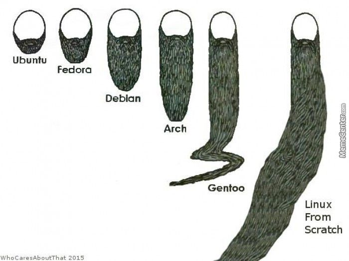

# Gentoo Linux: Pros and Cons

I hope you have seen this meme before about linux distributions compared with growing beard compared. As you see Gentoo stands close to Linux from scratch, simply the linux file system.

<figure><figcaption></figcaption></figure>

&#x20;have been an enthusiast for a while and have been tinkering with Gentoo Linux for more than a Year. Wiping drives has been my to do job for few months trying out new unix/linux operating systems in the market and Gentoo linux had been on my list to install. It has taught me more about the hardware level connection with software.

Most of the time you would listen some linux user mention \`ITS full of Compilation and Shit!\`. Well it's not true. The only part of its trueness is you will need to compile every package you install on your OS. Though Gentoo.org does provide binaries to install its your choice to decide whether you would like to compile packages or not but trying it out would help you learn how and what packages are necessary to run a good worthy operating system. Luckily if you stick to minimalist software then you dont have to deal with huge compilation times such as spending an entire day to compile a bloated software like Firefox or Chromium. Instead you can just stick to some minimalist software like \[surf]\(https://suckless.org/surf) created by Suckless Devs.&#x20;
