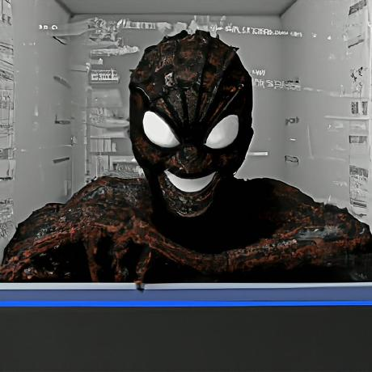

# 👋 Hello, World, lf32 here!

<figure><figcaption>
Akhil Raj a.k.a lf32
</figcaption></figure>

I am a Offensive Pentester and a Security Researcher.

I have kneen interest in exploring a lot of stuff on the internet and I spend most of my the time  reading other people blogs & subreddits.

I can't be like MrRobot because

Still a noob, I'm learning...
